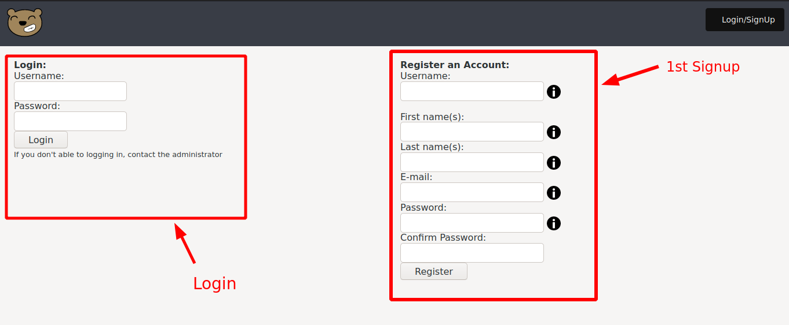
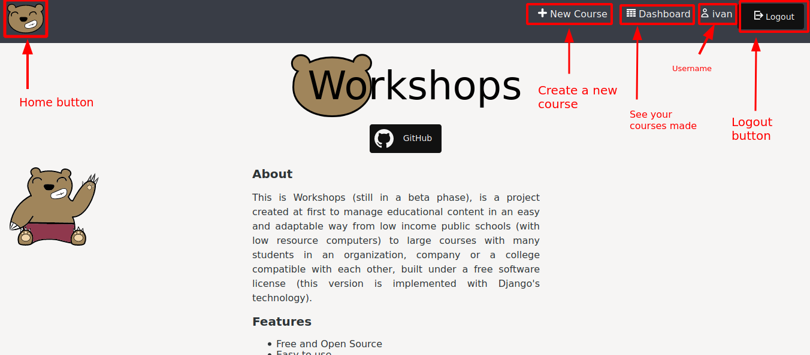
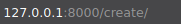
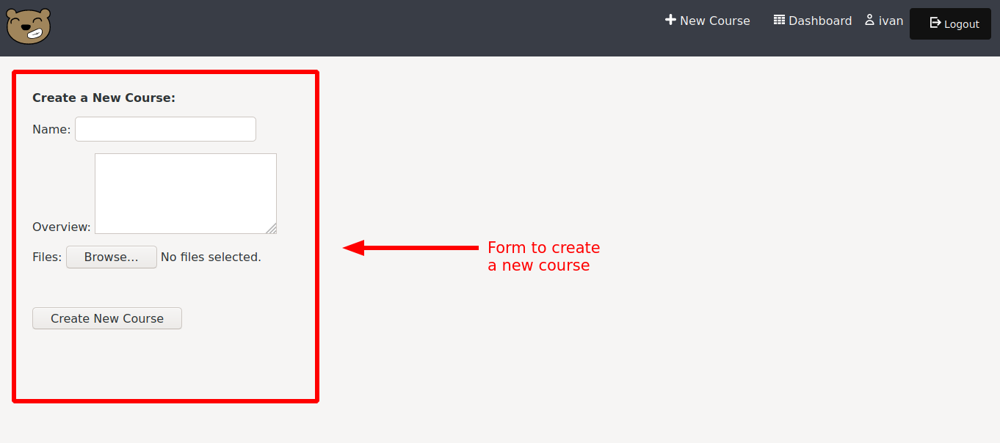
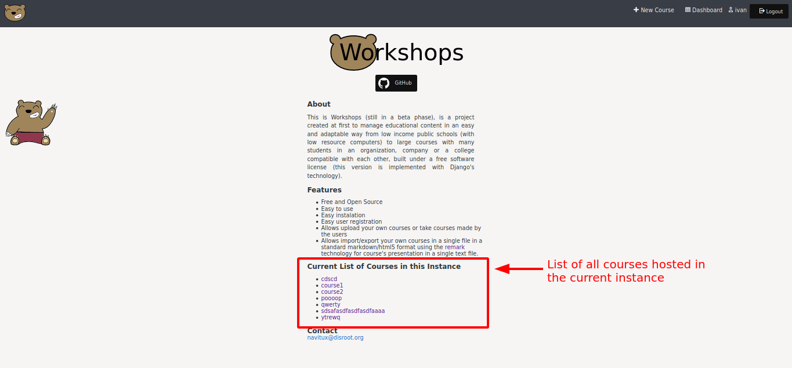

# WORKSHOPS

## Table of contents
* [About](#about)
* [Features](#features)
* [Dependencies](#dependencies)
* [Installation](#installation)
* [Basic Usage](#basic-usage)
* [License](#license)
* [Credits](#credits)


## ABOUT

Workshops is an open source, simple, dead-lightweight LMS (Learning Management System) application programmed in Python (version 3.8.x) with Django (version 2.2.x) web framework which main purpose is to make a standardized way to share knowledge via courses in a slide-based view in browser powered by [remark](https://github.com/gnab/remark) JavaScript library, easy to create, edit, delete and show your courses using simple markdown and HTML if necessary.
Inspired on an old project in my social labours (and now with the new 'normality' given by the global pandemic in 2020) to help share knowledge in an easy way without using privative and/or complicated software.

## FEATURES
- It's FOSS software (Free and Open Source) !!
- Easy to use (for all users registered or not in the instance)
- Intuitive interface with quick help and advices
- Easy Installation (for production or test environment)
- Perform creation/reading/updating/deleting (CRUD) operations on courses
- Allow import/export your own courses in a standardized single file (making them independent of the instances) this can be accomplished modifying/exporting the most important file in each course that is the **course**.**md** file and downloading the uploaded resources as well
- You can download the course a PDF using the builtin function in browser (it will be optimized in future)


## DEPENDENCIES

I try to keep only essential and necessary dependencies (trying, of course, not to reinvent the wheel):

```
Django==2.2.16
django-cleanup==5.1.0
psycopg2-binary==2.8.6
python-magic==0.4.22
pytz==2020.4
sqlparse==0.4.1
```
And as dependencies in the front-end (CSS and JavaScript libraries) I used:
```
jquery 3.6.0
jquery-modal 0.9.1
tippy.js 6
poppersjs 2
remarkjs 0.14.0
tachyons 4.12.0
```


## INSTALLATION
## Preinstallation:
It's important mention that you must know the basics about how Django webapps
works and how to setup a real configuration for a production instance.

You must create a Postgresql database. Here is a brief
tutorial to install Postgresql and create a database:

- On Debian/Ubuntu:

    ```
    $ sudo apt install postgresql postgresql-contrib
    ```

- On CentOS:

    ```
    $ sudo yum install postgresql-server postgresql-contrib
    ```

Once installed and configured your username as you prefer, you can access
your postgres CLI with the sudo user (not recommended for production
environments): ```sudo -u postgres psql``` , we will proceed
to create a new database:


    $ sudo -u postgres createdb workshops

Alternatively you can add a `local_settings.py` file as part of your own configuration
for your particular environment and tests (and this is SUPER IMPORTANT in a
production environment to keep secure your database's credentials, your SECRET_KEY
and DEBUG global variables for example) it must be located on the workshops/
folder, aside the `settings.py` file of the project.


## Quick installation for development/test environment
1. You can setup a virtual environment installing [virtualenv](https://virtualenv.pypa.io/en/latest/)
and typing the following commands in terminal (assuming that you're using a *nix-like environment):

    `$ virtualenv <folder_name>`

    Then you can activate it:

    `$ source <folder_name>/bin/activate`

    (and optionally you can exit from the virtual environment typing: `deactivate`)

2. Once made that you can download the project using git or simply downloading it
in a zip format and unzip it and go to the main top folder of workshops:
    ```
    (using git)
    $ git clone https://github.com/navitux/workshops_project.git
    $ cd workshops_project/
    (unzipping it)
    $ unzip workshops_project-master.zip
    $ cd workshops_project-master/
    ```
3. Using pip (inside the virtual environment) install the necessary dependencies
with pip from requirements.txt:
    ```
    $ pip install -r requirements.txt
    ```
4. We will run the default django's web server typing:
    ```
    $ python manage.py runserver
    ```


## BASIC USAGE
### Login and Signup
Once the application is running on the instance you can login or create a new
account clicking directly in the "Login/Signup" button at the first page loaded:


and you must be redirected to a your-server-name + /signupin/ url
(I'm using the default test environment configuration in the example):


And this is the login and 1st signup page:



### Creating your courses:
Once you have logged in you will see your username and other links in the
navigation bar as follows, you can just click on the "+ New Course" button
to begin making a course:



One clicked, you will be redirected to your-server-name + /create/ url:


<br>
<br>


You can upload images,videos, and the main and most important file: '**course**.**md**' file

When you are creating your course the **most important file must be the **course**.**md****
( this file must be named in this way to avoid failures or unexpected behaviors)
that will give the presentation and final layout to the course to be showed, it is
a plain text file formatted with markdown syntax following the rules of the
[remark](https://github.com/gnab/remark) JavaScript library (that does not vary so much
than normal markdown syntax) to arrange content in web slides in browser otherwise
the course does not will be showed.
#### How to write a good **course**.**md** file:
This is a brief example of a well written **course**.**md** file:
```
class: center, middle

# Cool course1

---

# Agenda

1. Blah
2. Blah blah
3. Blah blah blah

---

# Introduction


???
This slide only shows an embed image file uploaded in the instance
---

<iframe width="560" height="315" src="LOCAL:funny_video.mp4" frameborder="0" allow="encrypted-media" allowfullscreen></iframe>


???
This slide only shows an embed video file uploaded in the instance
```

The syntax is basically as follows according to the wiki of remarkjs library
( [remarkjs-markdown](https://github.com/gnab/remark/wiki/Markdown) )we will
include here only the most important aspects:
## IMPORTANT NOTE:
As is showed in the example file, to include the images or video files included
in your course YOU MUST INCLUDE THIS AS FOLLOWS: 'LOCAL:image.png' (without
quotes and all in caps with the name of the file without any space) in the url
of your file, just the key word `LOCAL:` and the filename such as `image.png`
without any space, otherwise the image, video or file will not be showed.

#### Slide Separators

A line containing three dashes, represents a slide separator (not a horizontal rule, `<hr>`,
like in regular Markdown). Thus, a simple Markdown text like the one below
represents a slideshow with two slides:
```
# Slide 1
This is slide 1
---
# Slide 2
This is slide 2
```

#### Incremental Slides

To avoid having to duplicate content if a slide is going to add to the previous
one, using only two dashes to separate slides will make a slide inherit the
content of the previous one:
```
# Slide

- bullet 1
--

- bullet 2
```
The above text expands into the following:
```
# Slide

- bullet 1
---

# Slide

- bullet 1
- bullet 2
```

#### Slide Notes

A line containing three question marks represents a separator of content and
note of the slide:
```
# Slide

Some content.

???
Some note.
```
A notes open version of a slide show can be shared by sharing the url with #p1
appended. Such as remarkjs.com/#p1.

With Incremental Slides the notes go after each increment
```
Hello
???
notes for hello
--
World
???
notes for world
```
#### Comments

If you want to leave a comment in your markdown, but not render it in the Slide
Notes, you can use either of the two following methods. The HTML style comment
will be available in the page's source in the browser, while the empty link
will not be.
HTML
```
<!--
I'm a comment.
-->
```
#### Empty Link
```
[//]: # (I'm a comment)
```
#### Slide Properties

Initial lines of a slide on a key-value format will be extracted as slide properties.

#### name

The name property accepts a name used to identify the current slide:
```
name: agenda

# Agenda
```
A slide name may be used to:

    Link to a slide using URL fragment, i.e. slideshow.html#agenda, or in Markdown; [the agenda](#agenda)

    Navigate to a slide using the API, i.e. slideshow.gotoSlide('agenda')

    Identify slide DOM element, either for scripting or styling purposes

#### background-image

The background-image property maps directly to the background-image CSS property,
which are applied to the current slide:
```
background-image: url(LOCAL:image.jpg)

# Slide with background image
```
REMEMBER: We use the keyword `LOCAL:` if the file was uploaded in the current
course otherwise this will not work.

#### count

The `count` property allows for specific slides not to be included in the slide
count, which is by default displayed in the lower right corner of the slideshow:
```
count: false

This slide will not be counted.
```
When the countIncrementalSlides configuration option is enabled, all
incremental slides will automatically have the `count: false` slide property set.

#### template

The `template` property names another slide to be used as a template for the
current slide:
```
name: other-slide

Some content.

---
template: other-slide

Content appended to other-slide's content.
```
The final content of the current slide will then be this:
```
Some content.

Content appended to other-slide's content.
```
Both template slide content and properties are prepended to the current slide,
with the following exceptions:

    `name` and `layout` properties are not inherited
    `class` properties are merged, preserving class order

The `template` property may be used to (apparently) add content to a slide
incrementally, like bullet lists appearing a bullet at a time.

Using only two dashes (--) to separate slides implicitly uses the preceding slide as a template:
```
# Agenda

--
1. Introduction

--
2. Markdown formatting
```
Template slides may also contain a special `{{content}}` expression to
explicitly position the content of derived slides, instead of having it
implicitly appended.

#### layout

The layout property either makes the current slide a layout slide, which is omitted from the slideshow and serves as the default template used for all subsequent slides:
```
layout: true

# Section

---

## Sub section 1

---

## Sub section 2
```
Or, when set to false, reverts to using no default template.

Multiple layout slides may be defined throughout the slideshow to define a common template for a series of slides.

### Seeing courses:
You can see all courses hosted in the current instance on the main page:



### Seeing your own courses:
You can click on "Dashboard" button in the navbar:


then you will see here all courses made for you:


and finally pressing on the "view button" you can open your course as bellow:


To share the course you can just copy the url of the course since each course
have an unique identifier accross all instances.


## LICENSE
This project uses the open source GNU GPLv3 license.

This program is free software: you can redistribute it and/or modify
it under the terms of the GNU General Public License as published by
the Free Software Foundation, either version 3 of the License, or
(at your option) any later version.

This program is distributed in the hope that it will be useful,
but WITHOUT ANY WARRANTY; without even the implied warranty of
MERCHANTABILITY or FITNESS FOR A PARTICULAR PURPOSE.  See the
GNU General Public License for more details.

You should have received a copy of the GNU General Public License
along with this program.  If not, see <https://www.gnu.org/licenses/>.

## CREDITS
- Creator: Ivan Robles [navitux](https://github.com/navitux/)

- Course's presentation RemarkJS: [remark](https://github.com/gnab/remark)

- Graphical resources: <https://www.svgrepo.com/>
